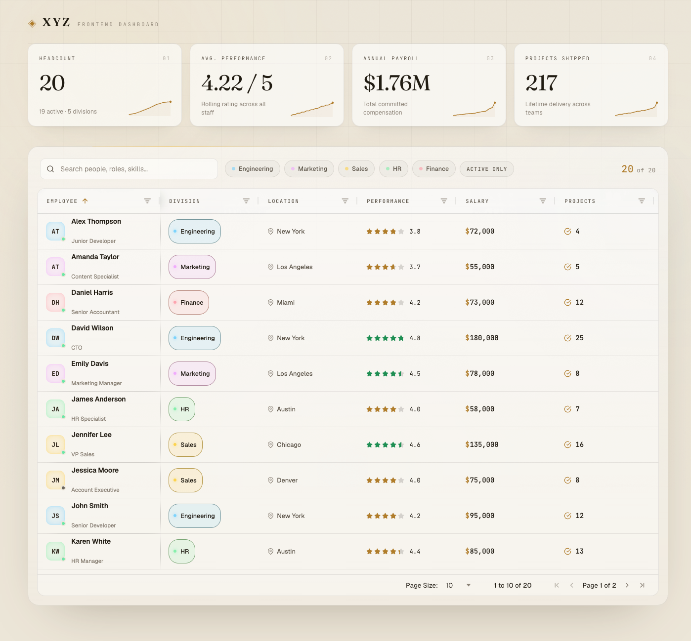

# XYZ — Workforce Dashboard

An immersive, editorial workforce dashboard built with **React + TypeScript**,
**Vite** and **AG Grid**. Employee records are fetched at runtime and presented
through a fully custom grid theme, bespoke cell renderers, animated KPI cards
and a warm ivory-paper aesthetic.



## Highlights

- **Runtime data fetch** — records load from `public/data.json` via the native
  `fetch` API, behind a branded loading screen (with a minimum display time so
  it doesn't flash). Error and retry states included.
- **Component-based architecture** — a thin data boundary (`App`) hands off to a
  presentation orchestrator (`Dashboard`); every piece of UI is a small, typed,
  single-responsibility component.
- **Custom AG Grid theme** — Quartz re-skinned via CSS variables into a
  gold / ink editorial palette: glass panel, pinned identity column, per-row
  entrance cascade, a soft hover spotlight, and pagination (10 rows/page).
- **Bespoke cell renderers** (`src/components/cells/`, one file each):
  - **Identity** — department-tinted avatar with a live status dot
  - **Division** — colour-coded pill (colours driven by CSS variables)
  - **Performance** — 5-star rating, gold-filled to the score (green for elite)
  - **Salary** — clean formatted figure (`$95,000`)
  - **Projects** — icon + count
  - **Tenure** — years served (bold) over the hire date, computed live
  - **Skills** — single-line chips + a `+N` pill; the full set reveals in an
    animated tooltip (slash wipe, light-blade streak, chips snapping in)
  - **Status** — pulsing active / inactive indicator
  - **Location** — pin icon + city
- **Animated KPI cards** — count-up values and real sparklines derived from the
  dataset (hire trend, salary / performance / project distributions) that
  re-draw on hover.
- **Interaction** — instant search (AG Grid quick filter), per-division filter
  chips, an "active only" toggle, plus native sorting, column filters, resizing
  and reordering.
- **Motion** — staggered entrance reveals via the Motion library, with full
  `prefers-reduced-motion` support. Responsive down to mobile.

## Tech stack

- **React 18** + **TypeScript 5.6**
- **Vite 5** (dev server + build)
- **AG Grid Community 32** (`ag-grid-react`)
- **Motion 11** for animation
- **react-icons** for iconography
- Fonts: Fraunces (display), Geist (UI), JetBrains Mono (data)

## Getting started

```bash
npm install

npm run dev      # start the dev server (Vite prints the local URL)
npm run build    # type-check (tsc --noEmit) + production build → dist/
npm run preview  # serve the production build locally
```

> Requires Node 18+.

## Project structure

```
public/
  data.json                  # the employee dataset, fetched at runtime
src/
  main.tsx                   # entry; imports global styles
  App.tsx                    # data boundary: useEmployees → Loader or Dashboard
  types.ts                   # single source of truth for all types + DEPARTMENTS
  hooks/
    useEmployees.ts          # fetch + loading/error state
    useEmployeeStats.ts      # derives the KPI stats (memoised)
  lib/
    animations.ts            # shared motion helper (reveal)
  components/
    Dashboard.tsx            # orchestrator: owns search/filter state, composes UI
    Masthead.tsx  Atmosphere.tsx  Loader.tsx
    Toolbar.tsx   SearchBar.tsx   DepartmentFilters.tsx
    StatCards.tsx EmployeeGrid.tsx
    css/                     # one stylesheet per component + global tokens/base
      tokens.css  base.css   ...
    cells/                   # one AG Grid cell renderer per file
      IdentityCell.tsx  DepartmentCell.tsx  PerformanceCell.tsx  ...
      index.ts             # barrel re-exporting every cell
      css/                 # matching per-cell stylesheets
```

### Conventions

- **Components** are arrow-function `const`s with a `default` export; their prop
  contracts live as interfaces in `src/types.ts`.
- **Styling** is plain co-located CSS (global class names, no CSS Modules):
  global tokens/reset in `components/css/{tokens,base}.css`, one stylesheet per
  component, and one per cell renderer under `components/cells/css/`.
- **Theme** — the dashboard ships a single light theme; design tokens (colours,
  fonts, radii) are CSS custom properties defined in `tokens.css`.

## Data

The dataset lives in [`public/data.json`](public/data.json) as a plain array of
employee records. Because it's served statically and loaded with `fetch`, the
data source is trivially swappable for a real API — point `useEmployees` at a
different URL and nothing else changes.
